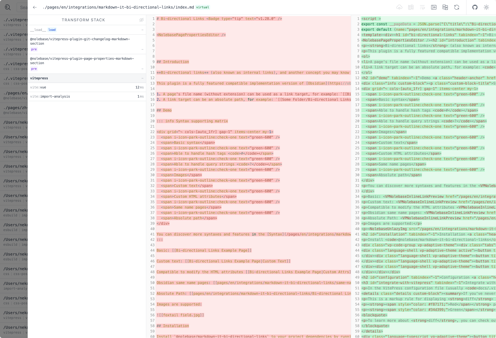

# Elements Transformation <Badge type="tip" text="v2.0.0-rc4" />

This is a low-level plugin that is intended to be used by advanced users who want to transform the `markdown-it` [tokens](https://markdown-it.github.io/markdown-it/#Token) to perform tasks like replacing elements, adding attributes, etc.

::: warning Before you start

This plugin primarily is a helper utility markdown-it plugin for [Inline Links Previewing](/pages/en/integrations/vitepress-plugin-inline-link-preview/) to help to transform all the `<a>` elements to `<VPNolebaseInlineLinkPreview>` components.

When using this plugin directly, you may encounter errors like `Invalid tag`, or `Element missing end tag` errors when integrating with VitePress or Vue markdown plugins after transforming [tokens](https://markdown-it.github.io/markdown-it/#Token) and elements,
or other markdown-it plugins that are not compatible with the transformed elements. Please use it when you understand how the [Token API](https://markdown-it.github.io/markdown-it/#Token) of `markdown-it` works.

:::

## Installation

Install `@nolebase/markdown-it-bi-element-transform` to your project dependencies by running the following command:

::: code-group

```shell [@antfu/ni]
ni @nolebase/markdown-it-bi-element-transform -D
```

```shell [pnpm]
pnpm add @nolebase/markdown-it-bi-element-transform -D
```

```shell [npm]
npm install @nolebase/markdown-it-bi-element-transform -D
```

```shell [yarn]
yarn add @nolebase/markdown-it-bi-element-transform -D
```

:::


## Usage

::: tip Suggestions to developers

When learning, debugging, we suggest including [`vite-plugin-inspect`](https://github.com/antfu/vite-plugin-inspect) in your project. It allows you to inspect the intermediate state of Vite plugins, Markdown transformations. After installing, you can visit [](http://localhost:5173/__inspect/) to inspect the modules and transformation stack of your project.

Check out install instructions in the [`vite-plugin-inspect` docs](https://github.com/antfu/vite-plugin-inspect).

<picture>
  <source srcset="./assets/vite-plugin-inspect-screenshot-day-theme.png" media="(prefers-color-scheme: light)">
  <source srcset="./assets/vite-plugin-inspect-screenshot-night-theme.png" media="(prefers-color-scheme: dark)">
  
</picture>

:::

### Change the tag of the elements

This is the living example code where we use it as references:

```ts twoslash
import MarkdownIt from 'markdown-it'
let markdownIt: MarkdownIt = null as unknown as MarkdownIt
// ---cut---
import { ElementTransform } from '@nolebase/markdown-it-element-transform'

markdownIt.use(ElementTransform, (() => {
  // Define variables inside the closure function to share the state between multiple tokens
  // Here we need a variable to track whether the next token needs to be transformed or not because we need to modify two tokens (link_open, link_close)
  let transformNextLinkCloseToken = false

  return {
    transform(token) {
      switch (token.type) {
        case 'link_open':
          // You can have some conditions here to skip the transformation
          //
          // Skip the transformation if the token is a header anchor
          // since usually the header anchor is not quite the same as the normal link
          if (token.attrGet('class') !== 'header-anchor') {
            // Modify the tag of the token
            token.tag = 'YourLinkComponentName'
            // Set the flag to transform the next link_close token
            transformNextLinkCloseToken = true
          }
          break
        case 'link_close':
          // Transform the token if the flag is set
          if (transformNextLinkCloseToken) {
            // Modify the tag of the token
            token.tag = 'YourLinkComponentName'
            // Reset the flag
            transformNextLinkCloseToken = false
          }

          break
      }
    },
  }
})())
```

### Use it to add more attributes to the elements

There are many use cases where you want to add more attributes to the elements.

For example:

1. Add `target="_blank"` and `rel="noopener noreferrer"` to all the `<a>` elements.
2. Add inline styles to all the `<span>` elements.
3. Add more classes to the elements.

#### Add `target="_blank"` and `rel="noopener noreferrer"` to links

```ts twoslash
import MarkdownIt from 'markdown-it'
let markdownIt: MarkdownIt = null as unknown as MarkdownIt
// ---cut---
import { ElementTransform } from '@nolebase/markdown-it-element-transform'

markdownIt.use(ElementTransform, (() => {
  return {
    transform(token) {
      if (token.type === 'link_open') {
        token.attrSet('target', '_blank')
        token.attrSet('rel', 'noopener noreferrer')
      }
    },
  }
})())
```

#### Add inline styles to the elements

```ts twoslash
import MarkdownIt from 'markdown-it'
let markdownIt: MarkdownIt = null as unknown as MarkdownIt
// ---cut---
import { ElementTransform } from '@nolebase/markdown-it-element-transform'

markdownIt.use(ElementTransform, (() => {
  return {
    transform(token) {
      if (token.type === 'span') {
        token.attrSet('style', 'color: red;')
      }
    },
  }
})())
```

#### Add more classes to the elements

```ts twoslash
import MarkdownIt from 'markdown-it'
let markdownIt: MarkdownIt = null as unknown as MarkdownIt
// ---cut---
import { ElementTransform } from '@nolebase/markdown-it-element-transform'

markdownIt.use(ElementTransform, (() => {
  return {
    transform(token) {
      if (token.type === 'span') {
        const existingClasses = token.attrGet('class') || ''
        token.attrSet('class', existingClasses + ' my-custom-class')
      }
    },
  }
})())
```

## Alternatives?

### [jeffbski/markdown-it-modify-token](https://github.com/jeffbski/markdown-it-modify-token)

Yes, this plugin does everything literally the same as [jeffbski/markdown-it-modify-token](https://github.com/jeffbski/markdown-it-modify-token). The reason why we have our own implementation is because we didn't know the existence of the plugin until we have implemented it.

Feel free to use the alternative if you want to. 😋
