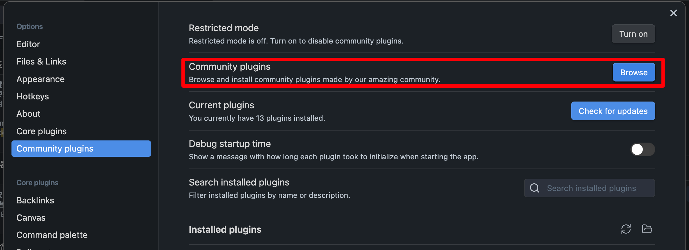
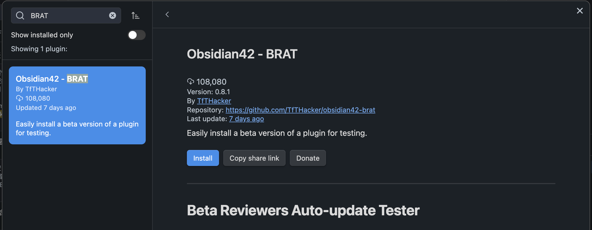
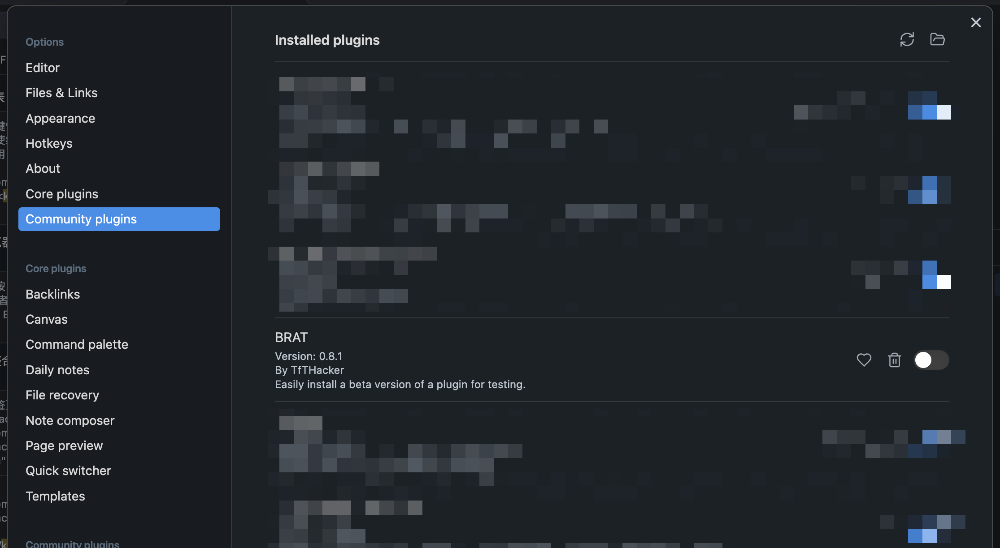
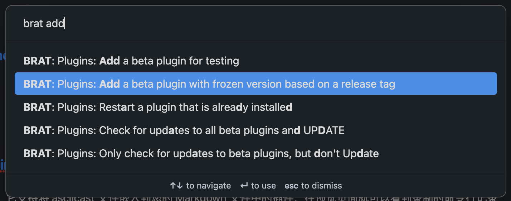

# UnoCSS Plugin <Badge type="warning" text="Beta" />

When crafting documentation in [Nólëbase](https://github.com/nolebase/nolebase), creating numerous visual components is crucial for enhancing the documents with dynamic and interactive user interfaces. This not only makes the content more digestible but also more engaging.
Previously, [Obsidian](https://obsidian.md) lacked the functionality to effectively integrate and apply styles from atomic CSS frameworks like [Tailwind CSS](https://tailwindcss.com/docs/display) and [Windi CSS](https://windicss.org/) to HTML elements within its platform.

This is where Obsidian UnoCSS Plugin kicks in, it allows you to write your notes in [Obsidian](https://obsidian.md/) with [UnoCSS](https://unocss.dev/).
By doing so, it has built a bridge by allowing the use of sufficiently simple and user-friendly atomic CSS classes, which enhances the aesthetics and functionality of the notes and documents we write in Obsidian.

## What can you do with it

- Embed interactive components in your notes.
- Style your notes with atomic CSS classes.
- Use themes and color schemes from UnoCSS communities.
- Import the icons from [Iconify](https://icones.js.org/).
- Animate your notes.
- Documenting color theories.
- Documenting UI/UX knowledge.
- Demonstrating the back scene of Mathemathics and Physics like [manim](https://github.com/ManimCommunity/manim/)
- And more...

## Demos

> Show me what you can do

### How it looks like

<br>

<video controls muted>
  <source src="./assets/demo-1.en.mp4" autoplay>
</video>

### What is the markup like

It's all basic just a set of HTML.

::: warning

To learn more about what are the meanings of classes, I recommend you to use the documentation sites of [Tailwind CSS](https://tailwindcss.com/docs/display) and [Windi CSS](https://windicss.org/) as references.

:::

<video controls muted>
  <source src="./assets/demo-2.en.mp4" autoplay>
</video>

### Hot-reloading capabilities in live preview mode

::: info

To do so, you need to split your Obsidian view into two panes, and choose "Source mode" for the editing pane where you wanted to view and edit the HTML markup.

:::

<video controls muted>
  <source src="./assets/demo-3.en.mp4" autoplay>
</video>

## How to use it

::: warning

Currently Obsidian UnoCSS Plugin is in alpha stage, it wasn't guaranteed to work properly and keep the compatibility with the future versions of itself.

But it is encouraged to try it out and give feedbacks. If you find and bugs or have any suggestions, please feel free to open an issue on [GitHub](https://github.com/nolebase/obsidian-plugin-unocss/issues).

:::

Currently, it is a bit hard to install the plugin for now before it is published to the official Obsidian plugin store. Manual downloading and installation is required.

### Install with beta testing helper [BRAT](https://tfthacker.com/brat-quick-guide) plugin

1. Install the [BRAT](https://tfthacker.com/brat-quick-guide) plugin right from the official Obsidian plugin store.

::: details Never learned how to install a plugin?

1. Go to "Preferences" or "Settings" (click the little gear icon on the bottom left corner of Obsidian).
2. Click "Community plugins" in the settings menu.
3. Turn on "Community plugins"


4. Click the "Browse" button to search for the BRAT plugin.



5. Search for "BRAT" and click the "Obsidian42 - BRAT" plugin.



6. Click "Install" to install the desired plugin.
:::

2. Enable the BRAT plugin in the community plugins settings menu.

::: details How to enable a plugin?

1. Go to "Preferences" or "Settings" (click the little gear icon on the bottom left corner of Obsidian).
2. Click "Community plugins" in the settings menu.
3. Find the desired plugin that you wanted to enable in the "Installed plugins" list.



4. Toggle on the right switch.

:::

3. Open Command palette to choose "BRAT: Plugins: Add a beta plugin for testing" as follows:



4. Copy and paste the following link to the first field of the new prompted dialog:

```txt
https://github.com/nolebase/obsidian-plugin-unocss
```

5. Find the needed released version on [Release page of Obsidian UnoCSS Plugin](https://github.com/nolebase/obsidian-plugin-unocss/releases), for example, fill in `0.1.0`:


6. Enable the "UnoCSS" plugin from the "Installed plugins" list.

### Install manually

1. Navigate to the [Release page of Obsidian UnoCSS Plugin](https://github.com/nolebase/obsidian-plugin-unocss/releases)
2. Find the [latest version of the plugin](https://github.com/nolebase/obsidian-plugin-unocss/releases/latest).
3. Download the `main.js` file and `manifest.json` file.
4. Open up the `.obsidian/plugins` directory of your Obsidian vault.
5. If no `.obsidian/plugins` directory exists, create one.
6. Create a new directory named `obsidian-plugin-unocss` inside the `.obsidian/plugins` directory.
7. Move `main.js` file and `manifest.json` file into the `obsidian-plugin-unocss` directory.

The directory structure should look like this after these steps:

```shell
❯ tree
.
├── main.js
├── manifest.json
```

8. Enable the "UnoCSS" plugin from the "Installed plugins" list.
