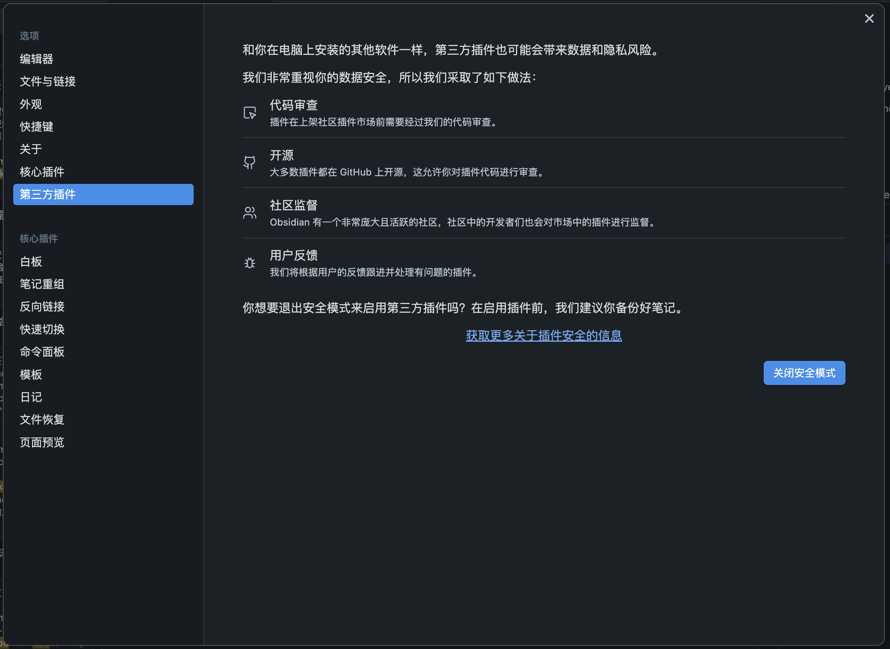
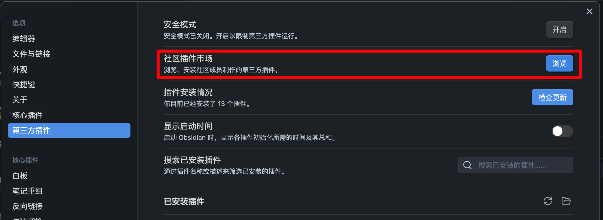
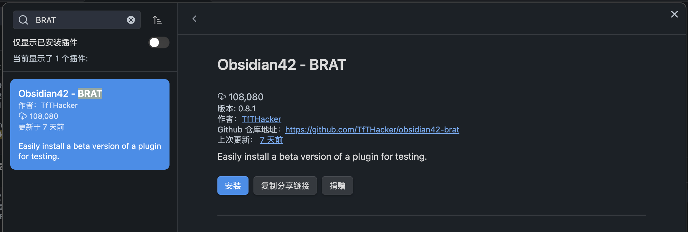
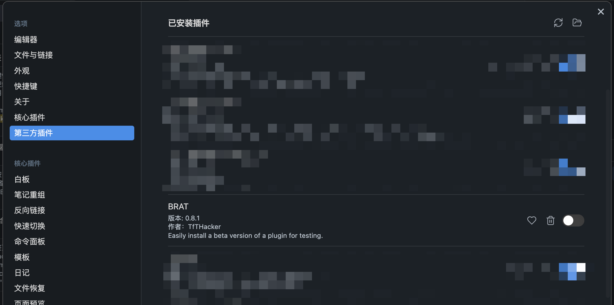
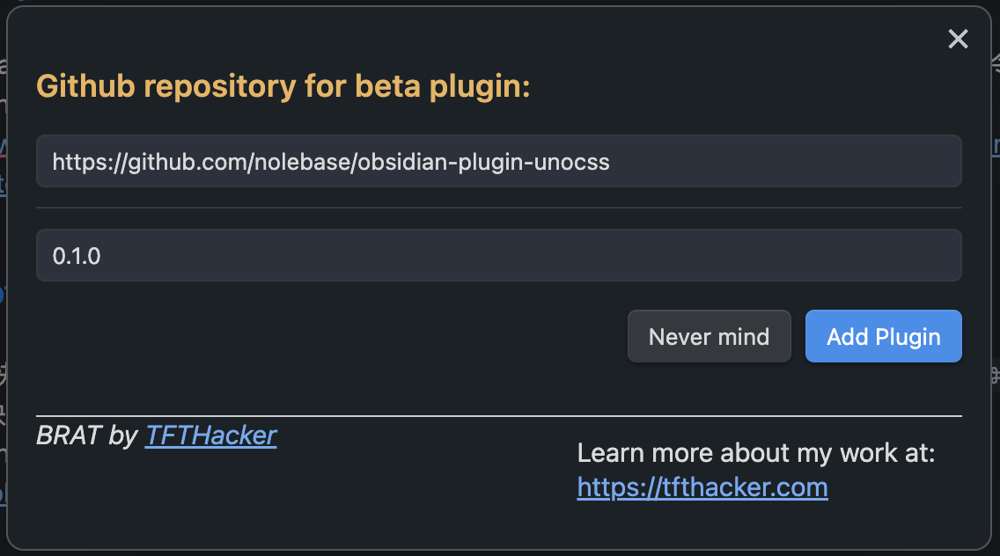

# UnoCSS 插件

在 [Nólëbase](https://github.com/nolebase/nolebase) 中编写文档的时候，创建大量可视化组件对于增强文档的动态和交互式用户界面至关重要。这不仅能使内容更易懂，而且更吸引人。
然而在有这个插件之前，[Obsidian](https://obsidian.md) 缺乏将 [Tailwind CSS](https://tailwindcss.com/docs/display) 和 [Windi CSS](https://windicss.org/) 这样的原子 CSS 库集成到文档中的能力。

这就是 [UnoCSS 插件](https://github.com/nolebase/obsidian-plugin-unocss) 的作用所在，它允许你使用 [UnoCSS](https://unocss.dev/) 所支持的原子类 CSS 在 [Obsidian](https://obsidian.md/) 中编写笔记和文档。
这样，它就架起了一座桥梁，让你可以直接在 Obsidian 中使用原子 CSS，从而提升文档的美观度和功能性。

## 所以到底能做什么

- 在笔记中嵌入互动组件
- 使用原子 CSS 类为笔记添加样式
- 使用 UnoCSS 社区提供的主题和配色方案
- 从 [Iconify](https://icones.js.org/) 导入图标
- 为笔记添加动画
- 为色彩理论编写文档
- 为 UI/UX 领域的知识编写文档
- 像 [manim](https://github.com/ManimCommunity/manim/) 一样可视化地演示数学和物理的背后原理
- 还有许许多多...

## 演示

> 给我看看功能呗

### 看起来是什么样子

<br>

<video controls muted>
  <source src="./assets/demo-1.zh-CN.mp4" autoplay>
</video>

### 怎么写的

就是一些基本的 HTML。

::: warning

要进一步了解这些类的含义，我建议你将 [Tailwind CSS](https://tailwindcss.com/docs/display) 和 [Windi CSS](https://windicss.org/) 的文档网站作为参考。

:::

<video controls muted>
  <source src="./assets/demo-2.zh-CN.mp4" autoplay>
</video>

### 在预览模式下的热重载能力

::: info

为此，您需要将 Obsidian 视图分割成两个屏幕，并为要查看和编辑的那个分屏选择「源码模式」。

:::

<video controls muted>
  <source src="./assets/demo-3.zh-CN.mp4" autoplay>
</video>

## 如何使用

::: warning

目前，Obsidian 的 UnoCSS 插件尚处于 alpha 阶段，无法保证其正常工作，也无法保证与未来版本的兼容性。

但我们鼓励大家试用并提供反馈意见。如果您发现错误或有任何建议，请随时在 [GitHub](https://github.com/nolebase/obsidian-plugin-unocss/issues) 上提交 Issue 联系我们。

:::

在我们于 Obsidian 官方的第三方插件索引中发布该插件之前，目前暂时还很难安装，需要手动下载和安装。

有两种主要的方式可以安装。

### 通过测试助手 [BRAT](https://tfthacker.com/brat-quick-guide) 安装插件

1. 直接从 Obsidian 官方的第三方插件索引中寻找并安装 [BRAT](https://tfthacker.com/brat-quick-guide) 插件。

::: details 没学过怎么安装插件？

1. 前往「Preferences」或者「设置」（点击 Obsidian 左下角的齿轮图标）
2. 在弹出的菜单中点选「第三方插件」
3. 阅读须知，确认开启插件功能后关闭「安全模式」



4. 点击「浏览」



5. 搜索「BRAT」并点击「Obsidian42 - BRAT」插件。



6. 点击「安装」安装所需的插件。
:::

2. 在第三方插件设置菜单中启用 BRAT 插件。

::: details 如何启用插件？

1. 前往「Preferences」或者「设置」（点击 Obsidian 左下角的齿轮图标）
2. 在弹出的菜单中点选「第三方插件」
3. 在「已安装插件」列表中找到要启用的插件。



4. 打开右侧开关。

:::

3. 打开命令面板，如下所示，选择「BRAT: Plugins: Add a beta plugin for testing」


4. 复制并粘贴以下链接到新提示对话框的第一个字段中：

```txt
https://github.com/nolebase/obsidian-plugin-unocss
```

2. 在 [Obsidian UnoCSS 插件的发布页面](https://github.com/nolebase/obsidian-plugin-unocss/releases)中找到所需的发布版本，例如下面填写的 `0.1.0`：



添加完成后在第三方插件设置菜单中启用「UnoCSS」插件。

### 手动安装

1. 前往 [Obsidian UnoCSS 插件的发布页](https://github.com/nolebase/obsidian-plugin-unocss/releases)
2. 找到[最新版本的插件](https://github.com/nolebase/obsidian-plugin-unocss/releases/latest)，下载 `main.js` 和 `manifest.json` 文件
3. 打开期望安装到的 Obsidian Vault 目录下方的 `.obsidian/plugins` 目录
4. 如果没有 `.obsidian/plugins` 目录，手动创建一个
5. 在 `.obsidian/plugins` 目录下创建一个名为 `obsidian-plugin-unocss` 的新目录
6. 将 `main.js` 文件和 `manifest.json` 文件移动到 `obsidian-plugin-unocss` 目录中

完成之后的目录应该是这样：

```shell
❯ tree
.
├── main.js
├── manifest.json
```

添加完成后在第三方插件设置菜单中启用「UnoCSS」插件。
